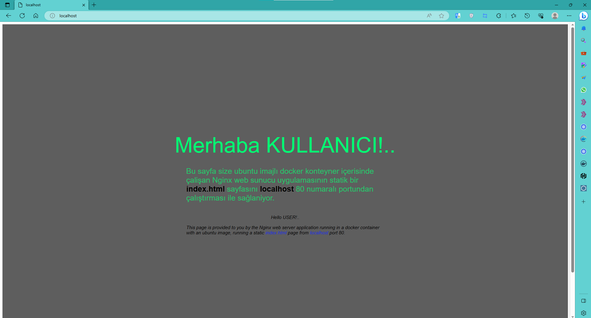

# Docker ile Ubuntu Tabanlı Web Sunucusu Konteyneri

Bu Docker projesi, Ubuntu 20.04 tabanlı bir konteyner oluşturur ve içerisine Nginx web sunucusu ve PHP-FPM kurulumu yapar. Konteyner, bir "index.html" ve "index.php" sayfasını yayınlar.


## Kullanım

1. Docker imajını oluşturmak için aşağıdaki komutu kullanın:

   ```
   docker build -t webserver-ubuntu .
   ```

2. Konteynerı ayağa kaldırmak için aşağıdaki komutu kullanın:

   ```
   docker container run -d -p 80:80 --name webserver webserver-ubuntu
   ```

3. Tarayıcınızı açın ve aşağıdaki URL'leri ziyaret edin:

   - Web sayfası: http://localhost/
   - API: http://localhost/api/

Her iki URL'de de "Merhaba KULLANICI!.." içerikli sayfaları göreceksiniz.




******************************************************************************************

# Docker Container for Ubuntu-based Web Server

This Docker project creates a container based on Ubuntu 20.04 and installs Nginx web server and PHP-FPM inside it. The container serves an "index.html" and "index.php" page.

## Usage

1. Use the following command to build the Docker image:

   ```
   docker build -t webserver-ubuntu .
   ```

2. To run the container, use the following command:

   ```
   docker container run -d -p 80:80 --name webserver webserver-ubuntu
   ```

3. Open your browser and visit the following URLs:

   - Web page: http://localhost/
   - API: http://localhost/api/

Both URLs will display pages with the content "Hello USER!..".

